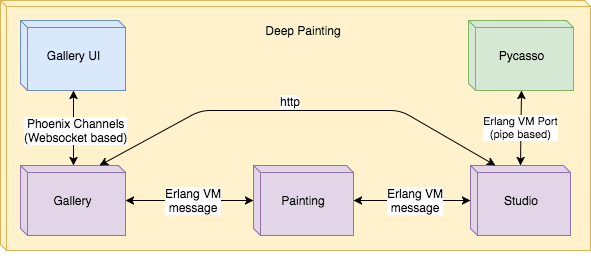

# Deep Painting

## Cómo funciona

En el siguiente diagrama se puede ver a alto nivel el algoritmo de transferencia de imágenes:

En cada interacción se calcula el error y el gradiente sumando:

- El error de contenido: Se calcula usando la suma de la diferencia al cuadrado entre 
la imagen objetivo y la de contenido. Estos valores se toman de una capa de la red VGG19 que 
distingue objetos (clasificar objetos es el motivo por el que VGG19 fue creada).

- El error de estilo: Se calcula usando la diferencia de matrices de gram en varias capas de la red VGG19.
Las diferentes capas representan diferentes niveles de estilo (detalles, formas y composición general)

Con el gradiente y usando su algoritmo obtenemos una nueva imagen objetivo que
deberá mantener el contenido (el primer componente intenta que el clasificador
siga viendo los mismos objetos) y tener un poco más del estilo.

## Algunos Resultados

Original

Usando como estilo [La noche estrellada](https://upload.wikimedia.org/wikipedia/commons/thumb/e/ea/Van_Gogh_-_Starry_Night_-_Google_Art_Project.jpg/1513px-Van_Gogh_-_Starry_Night_-_Google_Art_Project.jpg) de Van Gogh

Usando como estilo [El grito](https://upload.wikimedia.org/wikipedia/commons/thumb/f/f4/The_Scream.jpg/1280px-The_Scream.jpg) de Munch.

Usando como estilo [Mujer desnuda sentada](https://www.pablopicasso.org/images/paintings/seated-nude.jpg) de Picasso

## Arquitectura inicial

En el diagrama se pueden ver los pricipales componentes y cómo se comunican entre ellos. 
A continuación sigue una breve explicación de cada uno de ellos.

### Gallery

Es la aplicación que inicia, almacena, coordina y expone la interfaz de las imágenes.

Está escrita en Elixir, un lenguaje funcional y altamente concurrente que se ejecuta en la máquina virtual de Erlang.

Se comunica con Gallery UI mediante `Phoenix channels`, un protocolo del framework `Phoenix` basado en websockets.
Se comunica con Pycasso mediante `Erlang ports`, un mecanismo de comunicación entre procesos basado en `pipes`.

### Gallery UI 

Es la interfaz web de Gallery.

Desde ella el usuario puede iniciar o ver el estado de las imágenes creadas hasta ahora.

Está escrita en Elm, un lenguaje funcional puro con sintáxis similar a Haskell.

Se comunica con Gallery mediante `Phoenix channels`, un protocolo del framework `Phoenix` basado en websockets.

### Pycasso

Es la aplicación que usa "Deep learning" para crear las imágenes. 

Está escrita en Python, un lenguaje orientado a objetos que la comunidad científica tiende a usar.
Usa `tensorflow` y otras librerías de apoyo para ejecutar una variante de la red neuronal `VGG19`, que consiste de 
19 capas.

Se comunica con Gallery mediante `Erlang ports`, un mecanismo de comunicación entre procesos basado en `pipes`.

## Problema: Lentitud

Debido al gran tamaño de la red neuronal, generar una imágen de 400px de alto (sólo 10 iteraciones)  puede 
llevar en torno a una hora y media usando solo CPU. Dado que para conseguir buenas imágenes precisa de intentos
modificando los parámetros, éste rendimiento no es aceptable.

La solución es usar GPU, que puede hacer en proceso hasta 30-60 veces mas rápido. Dado que no cuento con un
ordenador en el cual usar la GPU, la decisión fué dividir la aplicación para asi poder correr la parte de
computación intensiva en la nube.

## Nueva Arquitectura

La idea es dividir Galery en dos partes. De este modo la parte que se comunica con Pycasso (se llamará Studio) 
puede estar en un servidor y la parte que se comunica con Gallery UI (que seguira siendo Gallery) en otro. 
Las partes comunes fueron extraidas a otra tercera aplicación llamada Painting.

Esta división permite tener todas las aplicaciones juntas en un servidor como en el siguiente diagrama:

Y también permite tener las aplicaciones separadas en dos servidores como en el siguiente diagrama:

### Gallery

Es la applicación que coordina y expone la interfaz de las imágenes.

Está escrita en Elixir, un lenguage funcional y altamente concurrente que corre en la máquina virtual de Erlang.

Se comunica con Gallery UI mediante `Phoenix channels`, un protocolo del framework `Phoenix` basado en websockets.
Se comunica con Painting mediante el paso de mensajes, un mecanismo de comunicación de Erlang.
Se comunica con Studio mediante HTTP.

### Gallery UI 

Es la interfaz web de Gallery.

Desde ella el usuario puede iniciar o ver el estado de las imágenes creadas hasta ahora.

Está escrita en Elm, un lenguaje funcional puro con sintaxis similar a Haskell.

Se comunica con Gallery mediante `Phoenix channels`, un protocolo del framework `Phoenix` basado en websockets.

### Painting

Ésta aplicación almacena las imágenes, tanto para Gallery como para Studio.

Está escrita en Elixir.

Se comunica con Gallery y Studio mediante el paso de mensajes, un mecanismo de comunicación de Erlang.

En el caso de un despliegue por separado, habrá dos instancias de Painting.

### Studio

Es la aplicación que recibe las peticiones de Gallery y monitoriza la ejecución de Pycasso.

Está escrita en Elixir.

Se comunica con Pycasso mediante `Erlang ports`, un mecanismo de comunicación entre procesos basado en `pipes`.
Se comunica con Painting mediante el paso de mensajes, un mecanismo de comunicación de erlang.
Se comunica con Studio mediante HTTP.

### Pycasso

Es la aplicación que usa "Deep learning" para crear las imágenes. 

Está escrita en Python, un lenguaje orientado a objetos que la comunidad científica tiende a usar. Usa
`tensorflow` y otras librerías de apoyo para ejecutar una variante de la red neuronal `VGG19`, que consiste de 
19 capas.

Se comunica con Studio mediante `Erlang ports`, un mecanismo de comunicación entre processos basado en `pipes`.

## Referencias

* [Elixir](https://elixir-lang.org/)
* [Erlang](https://www.erlang.org/)
* [Phoenix](http://www.phoenixframework.org/)
* [Elm](http://elm-lang.org/)
* [Python](https://www.python.org/)
* [Tensorflow](https://www.tensorflow.org/)
